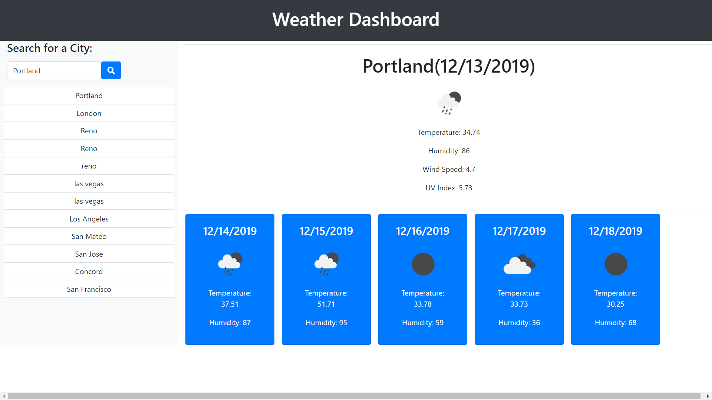
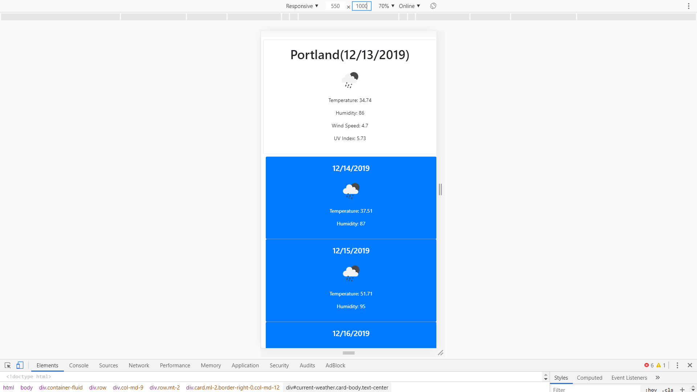

# Weather Dashboard

## Description

This website provides current weather data and future weather forecasts for multiple cities. The user inputs a city name into the search bar and that city's weather information on the screen. The website also keeps search history of the cities as a list of buttons under the search bar. Each time one of these buttons is clicked, the website will populate that city's weather data.

## Technologies Used

* [HTML](https://developer.mozilla.org/en-US/docs/Web/HTML)
* [CSS](https://developer.mozilla.org/en-US/docs/Web/CSS)
* [Javascript](https://developer.mozilla.org/en-US/docs/Web/JavaScript)
* [jQuery](https://jquery.com/)
* [Bootstrap](https://getbootstrap.com/)
* [Git](https://git-scm.com/)
* [GitHub](https://github.com/)
* [VSCode](https://code.visualstudio.com/)

## Deployed Link

* [https://yjmiranda.github.io/weather-dashboard/]

## Code Snipet

```
    var fiveDayURL = "https://api.openweathermap.org/data/2.5/forecast?q="+city+"&units=imperial&appid=2cf011e0ff0bddcd3b775b324d2a19d4";

    $.ajax({
        url: fiveDayURL,
        method: "GET"
    }).then(function(response){
        var fiveDay = $("#five-day");
        fiveDay.empty();
        
        for(var i = 0; i < response.list.length; i = i+=8){
            var date = response.list[i].dt_txt;
            var forcastDate = new Date(date).toLocaleDateString('en-US');

            var dayCard = $("<div>");
            dayCard.addClass("card col-md-2 ml-3 text-white bg-primary");

            var dayContent = $("<div>");
            dayContent.addClass("text-center");
            dayContent.addClass("card-body");

            var dateDiv = $("<h4>");
            dateDiv.text(forcastDate);

            var dayImg = $("");
            dayImg.attr("src", "http://openweathermap.org/img/wn/"+response.list[i].weather[0].icon +"@2x.png");

            var temperature = $("<p>");
            temperature.text("Temperature: " + response.list[i].main.temp);
    
    
            var humidity = $("<p>");
            humidity.text("Humidity: " + response.list[i].main.humidity);

            fiveDay.append(dayCard);
            dayCard.append(dayContent);
            dayContent.append(dateDiv);
            dayContent.append(dayImg);
            dayContent.append(temperature);
            dayContent.append(humidity);
        }
    });
```
This portion of the script.js file shows how the five-day forecast is rendered. The query url takes the value of the city that was submitted. The response data is then run through a for loop that itirates in increments of 8. This is done to account for the returned list of 40 objects that account for the 5 days.

## Screenshots

Screenshots at different widths.





## Author

**Yalí Miranda** 

* [Github](https://github.com/yjmiranda)
* [LinkedIn](https://www.linkedin.com/in/yal%C3%AD-miranda-8b4b94199/)